# 📝 Algorithms and data structures implemented in TS with test and documentation

## Data structures
- [Stack](data_structures/stack-list.ts)
- [Queue](data_structures/queue-list.ts)
- [Call Stack Virtual Machine](data_structures/exercise/virtualMachine.ts)
- [Min Heap](data_structures/min-heap.ts)
- [Max Heap](data_structures/max-heap.ts)
- [Hash Table](data_structures/hash-map.ts)
- [Tree](data_structures/tree.ts)
- [Trie](data_structures/trie.ts)
- [Binary Search Tree](data_structures/binary-search-tree.ts)
- [Graph](data_structures/graph.ts)
- [Weighted List Graph](data_structures/graphW.ts)
- [Weighted Matrix Graph](data_structures/graphMatrix.ts)

## Sorting
- [Bubble sort](sorting/bubble-sort.ts)
- [Insertion sort](sorting/insertion-sort.ts)
- [Merge sort](sorting/merge-sort.ts)
- [Quick sort](sorting/quick-sort.ts)
- [Heap sort](sorting/heap-sort.ts)

## Searching
- [Linear Search](searching/linear-search.ts)
- [Binary Search](searching/binary-search.ts)

## Recursion
- [Factorial](recursion/factorial.ts)
- [Fibonacci](recursion/fibonacci.ts)
- [Maze Solver](recursion/maze-solver.ts)
- [Sudoku Solver](recursion/sudoku-solver.ts)
- [Count Items](recursion/count-items.ts)
- [Find Max](recursion/find-max.ts)
- [Sum of integers](recursion/sum.ts)

## Greedy algorithms
- [Roman numerals](greedy/roman-numbers.ts)

