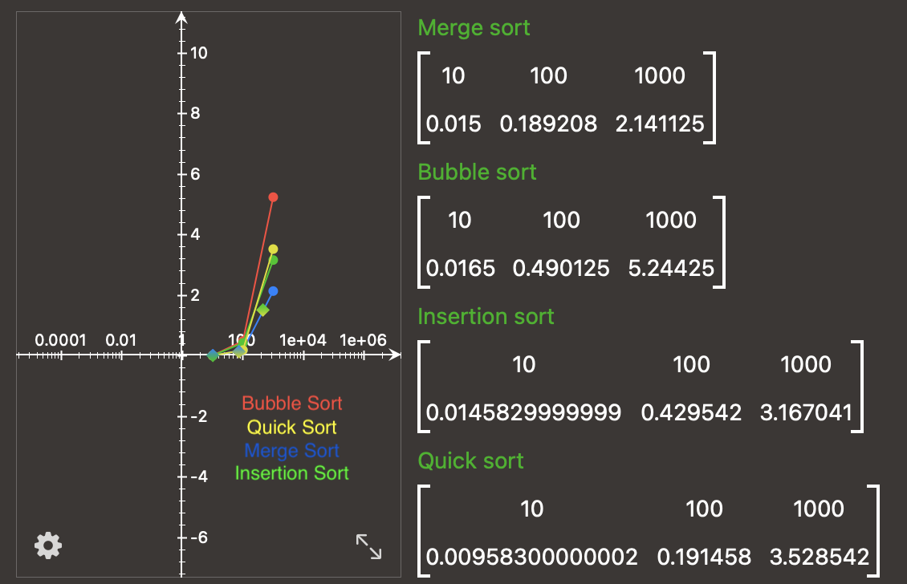

# 📝 Algorithms and data structures implemented in TS with test and documentation

## Data Structures
- [Stack](data_structures/stack-list.ts)
- [Queue](data_structures/queue-list.ts)
- [Call Stack Virtual Machine](data_structures/exercise/virtualMachine.ts)
- [Heap](data_structures/heap.ts)
- [HashMap](data_structures/hashMap.ts)

## Sorting
- [Bubble sort](sorting/bubble-sort.ts)
- [Insertion sort](sorting/insertion-sort.ts)
- [Merge sort](sorting/merge-sort.ts)
- [Quick sort](sorting/quick-sort.ts)

## Searching
- [Linear Search](searching/linear-search.ts)
- [Binary Search](searching/binary-search.ts)

## Recursion
- [Factorial](recursion/factorial.ts)
- [Fibonacci](recursion/fibonacci.ts)
- [Maze Solver](recursion/mazeSolver.ts)
